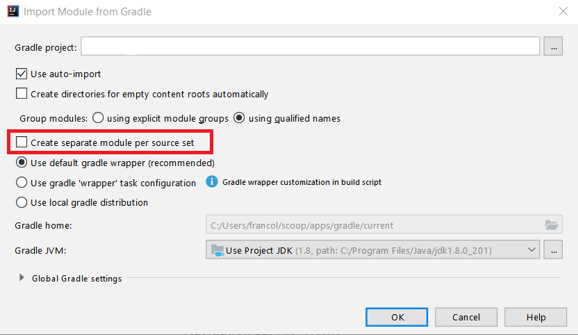

# Development

This document contains information for developers who want to contribute to the the project.

## How to compile the code

The project uses gradle and a gradle wrapper is included. That means that you can simply execute `./gradlew` (on Mac/Linux) or `gradlew.bat` (on Windows) to run it.

The project contains an ANTLR grammar from which a parser in Java is generated. To generate it run:

```
./gradlew generateGrammarSource
```

The code can then be compiled with:

```
./gradlew build
```

IDEA project files can be generated by running:

```
./gradlew idea
```

### IDEA 2019
After cloning the project, run
```
./gradlew idea
```
Then run the tests:
```
./gradlew test
```
You are now ready to import the gradle project into IDEA. We suggest to flag the "Automatically import this project on changes in build script files" option in gradle settings.

[Here is a short video on how to setup a Linux workstation to develop this project with IDEA 2019](https://youtu.be/eByxIBsLMp4)

### IDEA 2018
Then import in IDEA 2018 using these options:



**It's very important not to check "Create separate module per source set"!!!**

[Here is a short video on how to setup a Linux workstation to develop this project with IDEA 2018](https://youtu.be/4Kd1b-VPTEs)

## Running tests

All tests (except for performance tests) can be executed by running:

```
./gradlew check
```

To run performance tests (i.e. tests tagged with the annotation `@Category(PerformanceTest::class)`) run:
```
./gradlew testPerformance
```

To run all tests:
```
./gradlew testAll
```


If you want to force the execution of all checks:

```
./gradlew check -rerun-tasks
```

(_Side note: if you get this error running tests_
 ```
 com.esotericsoftware.kryo.KryoException: Buffer underflow
 ```
 _try to clean the .gradle directory_)

## Creating a jar with all dependencies to run some examples

You can create a jar that includes all the dependencies:

```
./gradlew fatJar
```

This will produce the file

``` 
rpgJavaInterpreter-core/build/libs/rpgJavaInterpreter-core-all.jar
```

So you can run an RPGLE file from the command line this way (after moving to the directory that contains this jar):

``` 
java -jar rpgJavaInterpreter-core-all.jar path/to/my/RPGLE [parameters]
```

[In this short video you can see how to run the examples](https://youtu.be/llw2vNeupA4)

See also this animation:


If you omit the program name, you will be able to call programs in a [simple shell](https://youtu.be/uNd6h5H2wTM).

## Autoformatting

It can be performed using the task `ktlintFormat`.

You can check formatting rules using:
``` 
gradlew ktlintCheck
``` 