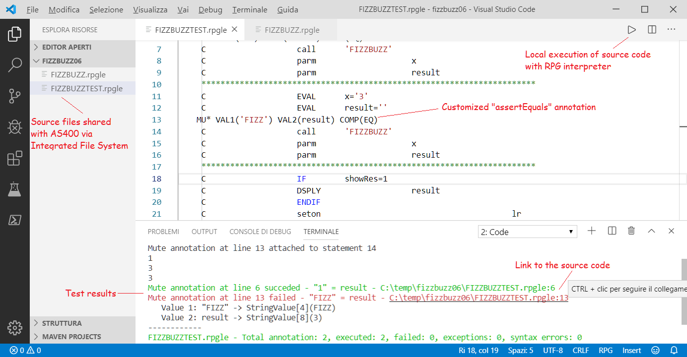

# Configuring Visual Studio Code for running rpgle tests

1. Install the [RPG extension](https://marketplace.visualstudio.com/items?itemName=NielsLiisberg.RPG) by [Niels Liisberg](https://github.com/NielsLiisberg)

2. Install the [Code Runner extension](https://marketplace.visualstudio.com/items?itemName=formulahendry.code-runner) by [Jun Han](https://github.com/formulahendry)

3. [Create an executable jar for executing MUTE tests](mute.md#command-line-utility) (`rpgJavaInterpreter-core-mute-all.jar`) and put it in a directory of your choice

4. Configure the Code Runner extension to execute this utility. The relevant portion of `settings.json` for that purpose is:

```
    "code-runner.executorMap": {
        "rpg": "cd $dir && java -DshowSourceAbsolutePath=true -jar /my/path/to/rpgJavaInterpreter-core-mute-all.jar $fileName",
    },
    "code-runner.clearPreviousOutput": true,
    "code-runner.enableAppInsights": false,
    "code-runner.saveAllFilesBeforeRun": true,
    "code-runner.showExecutionMessage": false,
    "code-runner.runInTerminal": true
```

(Note that the `-DshowSourceAbsolutePath=true` option is for enable links to source file and line numbers.)

5. Optionally configure some [snippets](https://code.visualstudio.com/docs/editor/userdefinedsnippets) to ease the editing of rpgle tests.

For example:

```
	"MUTE equal": {
		"prefix": "mue",
		"body": [
			"MU* VAL1($1) VAL2($2) COMP(EQ)"
		],
		"description": "MUTE annotation for equality"
	}
```

Here you can find a [rpg.json](../misc/visual_studio_code/rpg.json) file, in order to configure the snippets for the RPG language in Visual Studio Code.

6. Run the code with one of these methods:

    * use shortcut Ctrl+Alt+N
    * or press F1 and then select/type Run Code,
    * or right click the Text Editor and then click Run Code in editor context menu
    * or click Run Code button in editor title menu
    * or click Run Code button in context menu of file explorer

7. In order to ease fixed format typing, install [Overtype](https://marketplace.visualstudio.com/items?itemName=adammaras.overtype) by [Adam Maras](https://github.com/AdamMaras)

Here is a screenshot on how the Visual Studio Code environment could work this way.


